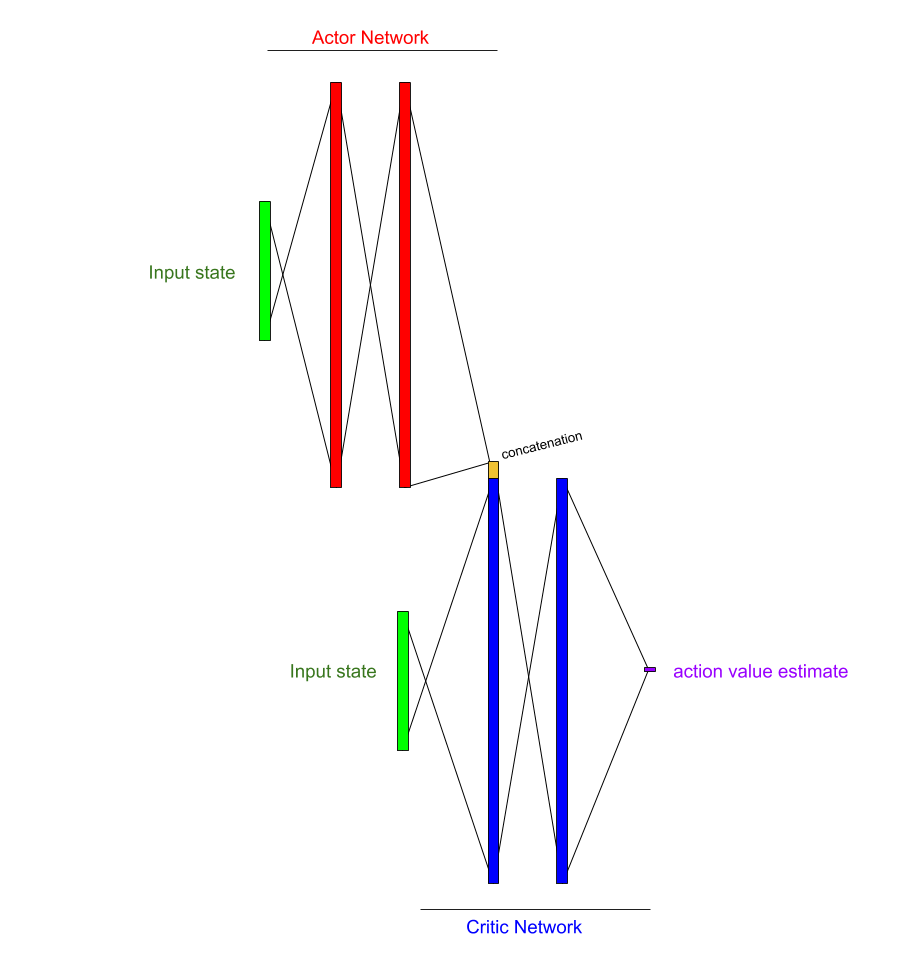
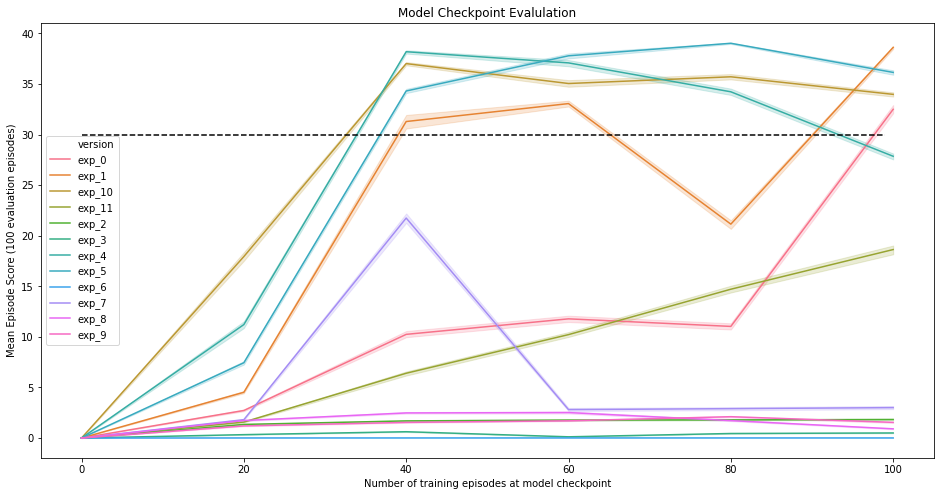

## Deep RL Nanodegree Project: Banana Collector Navigation

## Introduction

The objective of this project task was to implement a deep reinforcement learning solution for the 
Unity Engine ML-Agent Reacher environment.  This report outlines and 
describes my solution, highlighting the important regions of code, results that demonstrate 
solution of the task,  as well as future directions that could be explored to make the solution of 
this task even faster.  

## Methods and Model Description
### Repository Architecture and Development Process
This solution was coded in an agile process, by which minimum viable product models were iterated 
until a full solution was achieved.  In order to aid in this process, a client model interface was 
generated, in which new versions of models could be loaded and run via a training script and its 
calls to a generic model API.  The process of training is observed in the file `./scripts/train.py`.

### Training Script
The training script is generic and is responsible for interacting with a Model object API to perform
 the same set of steps for all model performance comparisons.  In brief, it is responsible for 
checking the repository configs settings to load a model version into the client model, and then 
interacts with that client's API in order to train, checkpoint, record performance, etc of the 
agent over the coarse of training.  

Upon running the script a progress bar is informative of the agent's current performance, in 
addition to mean loss scores for each network (discussed in more detail below).  The scores of each 
episode are recorded, alongside the hyperparameters and configuration dictionaries that were used to
 launch the training.  Thus any training experiment can be restored or repeated exactly, if 
 required.

### Evaluation Script
An evaluation script was utilized to compare the various checkpoints made during each model's 
training process, whereby network updates and random action choices are not utilised.  The result
of running the evaluation script is the recording of a large number of episode repetition scores for
each checkpoint of a model.  With this information, it is easy to compile a mean average episode 
score over the course of an agent's training.  

## Solution

### Base Network Architecture

Figure 1 - Description of the Discrete Deep Policy Gradient model architecture.  

### Training the network

A series of parameter sets were used to train the `DDPG_v1` model using the same training script.  
Various parameters were modified and tested over the different model versions.  

The final model solution selects actions using the actor network, with random noise added with 
propensity epsilon, which decreases over time.  Experiences are 
collected and stored  in an experience buffer, were the oldest experiences were
displaced after a certain buffer size had been reached.  Experiences from this buffer were sampled
randomly for each training step.  Each training step compared the expected Q_value for the recorded
state action pair against a target Q value composed of the actual reward recorded for the 
state-action combined with the discounted future return estimate which is generated from a "target"
copy of the "critic" network, which selects the next_actions using a target "actor" network.  The 
loss between these estimates represents error in estimation between actual episode returns and 
expected episode returns for a given state action.  

This loss is backpropigated across the actual critic network, which is in turn used to generate 
future Q-estimates for a state-action pair.  A soft-update that transfers weights from the actual critic
network to the target network is then performed.  

In order to actually choose actions given a state, the algorithm employs an actor network.  The 
actor network is responsible for outputing actions in a continuous space given encountered states.  
The actor network is trained as follows.  On-policy actions are generated given the encountered 
states.  These on-policy actions are then fed to the live critic network, which concatenates 
the on-policy actions as part of the network.  The forward propigation of this network provides a 
value representing the expected return for the on-policy actions given input states.  We train the 
actor network to output actions that generate the highest reward value by using the critic's 
Q-estimate as a reward function for gradient ascent.  Finally, a soft-update transfers 
some weights from the actual actor network to the target actor network.   

The code for this training can be found in the `execute_training_step` method of 
`model/DDPG_v1/model.Model` object.

Parameters and hyperparameters were adjusted for each experiment, and can be observed by examining
each experiments `hyperparams.json` and `params.json` file.  Run time parameters are also stored
alongside the training results in the data directory for posterity.  

## Results  
The networks for these models were checkpointed and standard intervals, and these checkpoints were 
used for evaluation of the agent's ability in the task environment.  
The fastest learning agent was experiment 10, which had solved the task within 40 episodes.  This 
 model version employed a large buffer size (100,000 experiences),
gradient clipping on the critic network, running 20 training steps after each 20 steps of an 
episode.  It likely that the increased number of training steps per training event contributed
to this model's rate of learning and comparison by episode number may not be wholely fair.   

### Evaluation performance

Figure 2 - Evaluation of the model checkpoints made during training of the final product model 
training regime over the course of 100 episodes, without random action selection.  

### Loading the product model
The final model weights can be restored and evaluated by running `make mount-prodmod` from inside
a docker container, and then `python3 ./scripts/evaluate.py`.  
The make command mounts pretrained checkpoint weights from a mounted directory in the base docker image.  
The docker image is freely available at `ccthompson/drlnd:0.0.7` and will be pulled automatically
via the installation instructions in the README.

## Conclusion
In conclusion, a basic implementation of the Deterministic Discrete Policy Gradient 
algorithm, utilising small two-layer networks for actor and critic models was capable of 
efficiently solving the `UnityEngine Reacher` task.  Important parameters for learning appeared 
to be the number of training steps, the size of the experience replay buffer, and pausing training
events during periods of experience collection.  

## Discussion

It is unlikely that the optimal solution has been trained here, as a grid search over the set of 
parameter and hyperparameters would likely yield a solution that trains more efficiently and 
provides a more stable score over time.  

A different future direction for this project could be to experiment with different types of solution.  While 
I did use the 20-agent version of the unity engine, the extra agents was only advantageous for 
increasing the rate of experience collection.  Having 20 agents provides the opportunity to attempt
solutions from the Asynchronous Advantage family.  

